# RAG Chatbot Architecture Analysis & Improvement Plan

**Date:** 2025-12-10
**Scope:** GuidelineAgent RAG Pipeline Analysis
**Target:** Identify bottlenecks, improve retrieval quality, enable conversation memory

---

## 1. CURRENT RAG PIPELINE ARCHITECTURE

### 1.1 End-to-End Flow Diagram

```mermaid
graph TB
    User["👤 User Query"]
    Widget["🌐 Widget/API Client"]
    Auth["🔒 JWT Auth & Tenant Validation"]
    Supervisor["🧭 SupervisorAgent<br/>(Intent Routing)"]

    User -->|sends message| Widget
    Widget -->|POST /chat| Auth
    Auth -->|tenant_id valid| Supervisor

    Supervisor -->|route to agent| DomainAgent["🤖 DomainAgent"]

    DomainAgent -->|1. Extract Intent| LLM1["LLM Call 1<br/>(Intent + Entities)"]
    LLM1 -->|parsed intent| ToolBind["🔧 Bind Tools to LLM"]

    ToolBind -->|with tools| LLM2["LLM Call 2<br/>(Generate Tool Calls)"]
    LLM2 -->|tool_calls| ToolExec["⚙️ Execute Tools"]

    ToolExec -->|RAG Tool| RAGPipeline["🔍 RAG Pipeline<br/>(Retrieval)"]
    ToolExec -->|HTTP Tool| ExternalAPI["🌐 External APIs"]

    RAGPipeline -->|results| LLM3["LLM Call 3<br/>(Final Answer)"]
    ExternalAPI -->|results| LLM3

    LLM3 -->|response text| Format["📋 Format Response"]
    Format -->|with metadata| SaveDB["💾 Save to DB"]
    SaveDB -->|return to user| Response["✅ Chat Response"]
    Response -->|SSE/HTTP| Widget

    style User fill:#e1f5ff
    style Widget fill:#f3e5f5
    style Auth fill:#fff3e0
    style Supervisor fill:#f1f8e9
    style DomainAgent fill:#fce4ec
    style RAGPipeline fill:#e0f2f1
    style LLM1 fill:#fff9c4
    style LLM2 fill:#fff9c4
    style LLM3 fill:#fff9c4
    style Response fill:#c8e6c9
```



---

### 1.2 RAG Retrieval Pipeline (Detailed)


---

### 1.3 Document Processing Pipeline (Current)

```mermaid
graph TB
    DocUpload["📤 Document Upload<br/>(PDF, DOCX, TXT)"]

    DocUpload -->|format detection| Loader["📖 Load Document<br/>(PyPDFLoader / python-docx)"]

    Loader -->|PDF| PDFProcess["📄 PDF Processing<br/>- Extract pages<br/>- Clean text artifacts"]
    Loader -->|DOCX| DocxProcess["📑 DOCX Processing<br/>- Extract sections<br/>- Include tables<br/>- Preserve hierarchy"]
    Loader -->|TXT| TxtProcess["📃 TXT Processing<br/>- Split paragraphs"]

    PDFProcess --> Chunker["✂️ Recursive Chunking<br/>chunk_size: 800<br/>overlap: 200"]
    DocxProcess --> Chunker
    TxtProcess --> Chunker

    Chunker -->|split documents| Chunks["📦 Chunks<br/>(avg 20-100 per doc)"]

    Chunks -->|enrich metadata| Metadata["🏷️ Add Metadata<br/>- tenant_id<br/>- doc_id<br/>- section_title<br/>- ingested_at"]

    Metadata -->|chunks + meta| Embedding["🔢 Generate Embeddings<br/>(all-MiniLM-L6-v2)"]

    Embedding -->|vectors| Storage["🗄️ Store in PgVector<br/>(langchain_pg_embedding)"]

    style DocUpload fill:#ffe0b2
    style Loader fill:#fff9c4
    style PDFProcess fill:#c8e6c9
    style DocxProcess fill:#c8e6c9
    style TxtProcess fill:#c8e6c9
    style Chunker fill:#f0f4c3
    style Chunks fill:#e1bee7
    style Metadata fill:#b2dfdb
    style Embedding fill:#fff9c4
    style Storage fill:#b3e5fc
```



---

### 1.4 Conversation Memory Flow (Current - LIMITED)

```mermaid
graph TB
    UserMsg["👤 User Message #1"]
    Save1["💾 Save to DB<br/>(messages table)"]
    AgentResp["🤖 Agent Response #1"]
    Save2["💾 Save to DB"]

    UserMsg --> Save1
    Save1 --> UserMsg2["👤 User Message #2"]
    AgentResp --> Save2
    Save2 --> UserMsg2

    UserMsg2 -->|Load last 15 messages| MemoryLoad["📋 Memory Loader<br/>(conversation_memory.py)"]

    MemoryLoad -->|filter by session| Messages["💬 Last 15 Messages<br/>- Role: user, assistant<br/>- Content text<br/>- Metadata"]

    Messages -->|convert to| LangChainMsg["🔄 LangChain Format<br/>HumanMessage<br/>AIMessage<br/>SystemMessage"]

    LangChainMsg -->|inject into| SystemPrompt["🧠 System Prompt<br/>(context window)"]

    SystemPrompt -->|max context| LLMInvoke["🤖 LLM Invoke<br/>(with context)"]

    LLMInvoke -->|response| AgentResp2["🤖 Agent Response #2"]

    style UserMsg fill:#e3f2fd
    style Save1 fill:#f3e5f5
    style AgentResp fill:#c8e6c9
    style Save2 fill:#f3e5f5
    style UserMsg2 fill:#e3f2fd
    style MemoryLoad fill:#fff9c4
    style Messages fill:#b2dfdb
    style LangChainMsg fill:#f0f4c3
    style SystemPrompt fill:#ffe0b2
    style LLMInvoke fill:#fff9c4
    style AgentResp2 fill:#c8e6c9
```



---

## 2. IDENTIFIED PROBLEMS & BOTTLENECKS

### 2.1 Document Processing & Retrieval Quality Issues

#### Problem 1: Fixed Chunk Size Limitations
**Current State:**
- Fixed chunk_size: 800 characters
- Fixed overlap: 200 characters
- No semantic awareness in chunking

**Impact:**
- ❌ Large tables/diagrams broken into meaningless chunks
- ❌ Multi-page sections split awkwardly
- ❌ Loss of context boundaries (e.g., Q&A pairs split)
- ❌ Chunk size not optimized for embedding model

**Root Cause:**
```python
# backend/src/services/document_processor.py
RecursiveCharacterTextSplitter(
    chunk_size=800,  # Hard-coded
    chunk_overlap=200,
    separators=["\n\n", "\n", ". ", " ", ""]
)
```

---

#### Problem 2: Limited Metadata for Retrieval
**Current State:**
- Only basic metadata stored:
  - tenant_id, doc_id, section_title, source, ingested_at
- No quality indicators

**Impact:**
- ❌ Cannot filter by document importance/type
- ❌ No way to boost/penalize certain sources
- ❌ Missing semantic tags (topic, category, complexity)
- ❌ No versioning for document updates

**Missing Metadata:**
```python
# Should include:
- doc_type: str  # "policy", "faq", "guide", "regulation"
- priority: int  # 1-5 (boost in ranking)
- domain: str  # "debt", "analysis", "product"
- confidence_score: float  # how trustworthy is this content
- last_updated: datetime
- version: str
```

---

#### Problem 3: Naive Retrieval Strategy
**Current State:**
- Pure cosine similarity search (single call)
- No re-ranking or diversity
- No semantic comprehension

**Impact:**
- ❌ Similar chunks ranked by statistical similarity, not semantic relevance
- ❌ Duplicate/redundant documents in results
- ❌ No handling of ambiguous queries (returns all similar)
- ❌ Cold-start problem for new documents (no usage signals)

**Example Problem:**
```
Query: "How to resolve debt disputes?"

Retrieved (top 3):
1. "...dispute resolution process..." (cosine: 0.89)
2. "...similar terms in dispute handling..." (cosine: 0.88)  ← Redundant!
3. "...resolve conflicts..." (cosine: 0.87)  ← Wrong context (HR?)

Missing: Best answer that isn't purely statistical match
```

---

#### Problem 4: No Context Windows/Hierarchical Retrieval
**Current State:**
- Retrieves standalone chunks
- No concept of "sections" or "documents"

**Impact:**
- ❌ LLM receives fragmented context
- ❌ Loses document structure and narrative flow
- ❌ Cannot understand prerequisites/dependencies
- ❌ Insufficient context for complex topics

**Example:**
```
User: "What steps are needed for debt settlement?"

Current: Returns 5 random chunks about debt
Result: LLM pieces together from fragments

Better: Return full section with heading + intro + steps + examples
```

---

### 2.2 Conversation Memory Problems (CRITICAL)

#### Problem 1: Limited Memory Window
**Current State:**
```python
# Load last 15 messages
messages = db.query(Message)
    .filter(Message.session_id == session_id)
    .order_by(Message.created_at.desc())
    .limit(15)  # Only 15 messages!
```

**Impact:**
- ❌ Multi-turn conversations (>15 turns) lose earlier context
- ❌ Cannot maintain topic continuity in long conversations
- ❌ LLM "forgets" earlier decisions/constraints
- ❌ Users need to repeat context

**Example Problem:**
```
Turn 1-5: User discusses debt amount, payment capacity, timeline
Turn 15: Still in context
Turn 16: NEW USER MESSAGE → Earlier context lost! ❌

LLM: "I don't have context about your financial situation"
User: frustrated 😞
```

---

#### Problem 2: No Conversation Summarization
**Current State:**
- Stores raw messages only
- No compression of old messages

**Impact:**
- ❌ Token usage grows with conversation length
- ❌ API costs increase exponentially
- ❌ Slower response times (more to parse)
- ❌ Cannot maintain context beyond ~20 messages practically

**Token Cost Analysis:**
```
10 messages:   ~2,000 tokens (memory)
20 messages:   ~4,000 tokens (memory)
30 messages:   ~6,000 tokens (memory)
50 messages:   ~10,000 tokens (memory + actual question)
100 messages:  ~20,000 tokens (exceeds many model limits!)
```

---

#### Problem 3: No Context Importance Ranking
**Current State:**
```python
# All messages treated equally
last_15_messages = [msg1, msg2, ..., msg15]
# Chronologically ordered, lose semantic importance
```

**Impact:**
- ❌ Early context (less relevant) takes same weight as recent
- ❌ No emphasis on critical decisions/constraints
- ❌ Wastes token budget on old pleasantries

**Example:**
```
Turn 1: "Hi, how are you?" (useless, 2 tokens)
Turn 10: "My debt is $50,000" (critical, 5 tokens)
Turn 15: "Can I settle for less?" (relevant, 6 tokens)

Current: Loads all 3 equally ❌

Better: Prioritize turns 10, 15 with weighting ✅
```

---

#### Problem 4: No Cross-Session Learning
**Current State:**
- Each session isolated
- No knowledge of user's previous sessions

**Impact:**
- ❌ Cannot leverage historical user preferences
- ❌ Cannot maintain long-term user profile
- ❌ Repeated questions across sessions
- ❌ Cannot build user-specific knowledge base

**Example:**
```
Session 1: User clarifies they prefer email over phone
Session 2: User asks "What's the best way to contact?"
Agent: "You can call or email"  ❌ Ignores preference

Better: Check user's past sessions → "Email works best for you"
```

---

### 2.3 LLM Invocation & Tool Use Issues

#### Problem 1: Fixed Tool Selection
**Current State:**
```python
# Load tools by agent_id
tools = db.query(AgentTool)
    .filter(AgentTool.agent_id == agent_id)
    .order_by(AgentTool.priority.desc())
    .limit(5)  # Hard-coded limit
```

**Impact:**
- ❌ Cannot dynamically select tools based on query
- ❌ Always loads same tools regardless of question type
- ❌ Wastes tokens binding irrelevant tools
- ❌ Cannot prioritize specialized tools for specific queries

**Example:**
```
Agent: "DebtAgent" (always has these tools: RAG, HTTPCall, Database)

Query 1: "Give me info from documents"
  → Needs: RAG ✅, HTTP ❌, Database ❌

Query 2: "Get real-time debt status"
  → Needs: Database ✅, HTTP ✅, RAG ❌

Problem: All tools bound regardless ❌
```

---

#### Problem 2: Single-Step RAG Integration
**Current State:**
- RAG tool called once in tool execution
- No re-iteration or refinement
- No query expansion

**Impact:**
- ❌ Cannot handle complex, multi-faceted queries
- ❌ Initial retrieval poor? No second chance
- ❌ Cannot break down complex question into sub-queries
- ❌ No clarification on ambiguous results

**Example:**
```
User: "What documents support my debt settlement claim?"

Current flow:
1. LLM calls RAG tool with full query
2. Gets 5 docs that partially match
3. Done (may miss relevant docs)

Better flow:
1. LLM: "I need to break this into sub-queries"
2. Sub-query 1: "debt settlement policies" → 5 docs
3. Sub-query 2: "claim procedures" → 5 docs
4. Sub-query 3: "evidence requirements" → 5 docs
5. LLM: Synthesize all 15+ docs into comprehensive answer
```

---

### 2.4 Vector Database & Retrieval Infrastructure

#### Problem 1: No Query Expansion
**Current State:**
```python
# Query embedding done directly
embedding = embedding_service.embed_query(query_text)
# Single vector lookup
results = pgvector.similarity_search(embedding, k=5)
```

**Impact:**
- ❌ Single phrasing misses synonyms
- ❌ Short queries underspecified (no expansion)
- ❌ Semantic variations not captured

**Example:**
```
Query: "debt payment"
Vector space: may miss "repayment", "settlement", "installment"

Better: Expand query →
  - "debt payment"
  - "debt repayment"
  - "payment plan"
  - "settlement arrangement"
→ Search with multiple vectors, merge results
```

---

#### Problem 2: No Hybrid Search
**Current State:**
- Pure vector similarity (semantic only)

**Impact:**
- ❌ Cannot combine semantic + keyword search
- ❌ Misses exact phrase matches
- ❌ False positives from semantic confusion

**Example:**
```
Query: "charge-off" (specific debt term)

Vector search:
- Returns "fees and charges" (wrong, cosine similar)
- Misses "debt charge-off procedures" (exact match)

Hybrid search:
- Keyword: Find exact "charge-off" match ✅
- Vector: Find semantic "debt cancellation" ✅
- Merge: Return best of both
```

---

#### Problem 3: No Indexing Strategy
**Current State:**
- Linear scan with limit 5
- No multi-level indexing

**Impact:**
- ❌ Retrieval slow as vector table grows (millions of docs)
- ❌ No importance-based indexing
- ❌ Cannot scale to enterprise knowledge bases

---

## 3. CONVERSATION MEMORY - ROOT CAUSE ANALYSIS

### Current Implementation
```python
# backend/src/services/conversation_memory.py
def load_conversation_memory(session_id: str, limit: int = 20):
    messages = db.query(Message)
        .filter(Message.session_id == session_id)
        .order_by(Message.created_at.desc())
        .limit(limit)  # PROBLEM: Fixed window ❌

    # Convert to LangChain format
    lc_messages = [
        HumanMessage(content=msg.content) if msg.role == "user" else AIMessage(...)
        for msg in messages
    ]

    return lc_messages  # Chronologically ordered
```

### Why Multi-Turn Fails

| Aspect | Current | Required |
|--------|---------|----------|
| **Memory Window** | 15-20 messages | 100+ messages (compressed) |
| **Token Budget** | No limit (cost spiral) | Capped at 4K-8K tokens |
| **Summarization** | None | Ongoing compression |
| **Importance Weighting** | None | Critical decisions prioritized |
| **Cross-Session** | Isolated | Linked to user history |
| **Context Queries** | None | "What did I say about X?" |

---

## 4. MERMAID DIAGRAM: CURRENT vs PROPOSED MULTI-TURN

### Current (Broken)


### Proposed (Improved with Summarization)

```mermaid
graph TB
    T1["Turn 1-3"]
    T4["Turn 4-7"]
    T8["Turn 8-12"]
    T13["Turn 13-15"]
    T16["Turn 16 - NEW"]

    T1 --> Summ1["🔄 Summarize<br/>Early Context"]
    T4 --> Summ2["🔄 Summarize<br/>Mid Context"]
    T8 --> Summ3["🔄 Summarize<br/>Recent Context"]
    T13 --> Keep["Keep Full<br/>Recent Messages"]

    Summ1 -->|"Summary:<br/>User has $50K debt,<br/>prefers email, needs<br/>settlement plan"| Compressed["Compressed<br/>Memory"]
    Summ2 -->|"Summary:<br/>Discussed income,<br/>monthly capacity $1K"| Compressed
    Summ3 -->|"Summary:<br/>Interested in<br/>settlement option"| Compressed
    Keep -->|Full messages| Compressed

    T16 -->|LOAD| Memory["Memory Loader<br/>(Compressed)"]
    Memory -->|Load: Summary+Recent| Context["Context Window<br/>(4K-8K tokens)<br/>- Summary (early)<br/>- Full messages (recent)"]

    Context -->|Complete Context!| LLM["LLM"]
    LLM -->|Uses full history| Response["✅ Coherent Response<br/>✅ No repetition needed<br/>✅ Continuity maintained"]

    style T1 fill:#c8e6c9
    style Compressed fill:#b3e5fc
    style Context fill:#c8e6c9
    style Response fill:#c8e6c9
    style Memory fill:#fff9c4
```


---

## 5. SOLUTIONS & IMPROVEMENT ROADMAP

### 5.1 Quick Wins (1-2 days)

#### Solution 1: Increase Memory Window
**Change:**
```python
# FROM:
limit(15)  # 15 messages

# TO:
limit(50)  # 50 messages (if tokens allow)
```

**Impact:** ✅ Immediate improvement in multi-turn coherence
**Cost:** Minimal (token usage increase ~2-3K)
**Implementation:** 1 line change

---

#### Solution 2: Add Message Summarization (Simple)
**Approach:** Summarize every 20 messages

```python
async def auto_summarize_old_messages(session_id: str, threshold: int = 20):
    """
    Summarize messages older than threshold into a summary message
    """
    messages = db.query(Message).filter(
        Message.session_id == session_id,
        Message.created_at < (now - 1_hour)
    ).limit(threshold)

    if len(messages) >= threshold:
        # Create summary via LLM
        summary_text = await llm.summarize_messages(messages)

        # Delete old messages, keep summary
        db.delete(messages)
        db.add(Message(
            session_id=session_id,
            role="system",
            content=f"**CONVERSATION SUMMARY**:\n{summary_text}"
        ))
        db.commit()
```

**Impact:** ✅ Maintain context without token explosion
**Cost:** 1 additional LLM call per 20 messages
**Implementation:** 2-3 hours

---

### 5.2 Medium Improvements (3-5 days)

#### Solution 3: Semantic Message Importance Scoring

```python
async def score_message_importance(message: Message) -> float:
    """
    Score messages by importance:
    - Contains decisions/actions: 1.0
    - Contains constraints/preferences: 0.8
    - Contains context/info: 0.5
    - Small talk: 0.1
    """
    importance = await llm.score_importance(message.content)
    return importance

async def load_important_messages(session_id: str, max_tokens: int = 8000):
    """
    Load messages by importance, respecting token budget
    """
    messages = db.query(Message).filter(
        Message.session_id == session_id
    ).all()

    # Score and sort
    scored = [(msg, await score_message_importance(msg)) for msg in messages]
    scored.sort(key=lambda x: x[1], reverse=True)

    # Pack by tokens
    selected = []
    tokens_used = 0
    for msg, importance in scored:
        msg_tokens = len(msg.content) // 4  # Rough estimate
        if tokens_used + msg_tokens < max_tokens:
            selected.append(msg)
            tokens_used += msg_tokens

    return sorted(selected, key=lambda m: m.created_at)  # Chronological
```

**Impact:** ✅ Efficient token usage, maintains critical context
**Cost:** 1 LLM call for scoring (amortized)
**Implementation:** 3-4 hours

---

#### Solution 4: Cross-Session User Context

```python
async def load_user_context(user_id: str) -> str:
    """
    Load persistent user context from all past sessions
    """
    past_sessions = db.query(ChatSession).filter(
        ChatSession.user_id == user_id,
        ChatSession.created_at > (now - 30_days)  # Last 30 days
    ).all()

    # Extract key facts from each session
    context_facts = []
    for session in past_sessions:
        messages = db.query(Message).filter(
            Message.session_id == session.session_id
        ).all()

        # Extract key facts
        facts = await llm.extract_facts(messages)
        context_facts.extend(facts)

    # Deduplicate and merge
    return await llm.merge_facts(context_facts)

# Usage in agent system prompt:
system_prompt = f"""
You are a helpful debt advisor.

USER PROFILE:
{await load_user_context(user_id)}

CURRENT CONVERSATION:
{load_conversation_memory(session_id)}
"""
```

**Impact:** ✅ Personalized responses, cross-session continuity
**Cost:** 1-2 additional LLM calls
**Implementation:** 3-4 hours

---

### 5.3 Advanced Solutions (1-2 weeks)

#### Solution 5: Intelligent Document Chunking

**Problem:** Fixed chunk size breaks semantic units
**Solution:** Semantic-aware chunking

```python
async def semantic_chunk_document(doc_text: str, target_chunk_size: int = 800):
    """
    Chunk document by semantic boundaries, not character count
    """
    # Parse document structure
    sections = parse_document_structure(doc_text)  # Headings, paragraphs

    chunks = []
    current_chunk = ""

    for section in sections:
        # Try to fit section
        if len(current_chunk) + len(section.text) <= target_chunk_size:
            current_chunk += section.text
        else:
            # Section too large or chunk full
            if current_chunk:
                chunks.append(current_chunk)

            # If section itself is large, split semantically
            if len(section.text) > target_chunk_size * 1.5:
                sub_chunks = await split_by_sentences(section.text, target_chunk_size)
                chunks.extend(sub_chunks)
            else:
                current_chunk = section.text

    return chunks
```

**Impact:** ✅ Better chunk coherence, improved retrieval quality
**Implementation:** 1-2 days

---

#### Solution 6: Hybrid Retrieval (Vector + Keyword)

```python
async def hybrid_search(query: str, top_k: int = 5):
    """
    Combine vector similarity + BM25 keyword search
    """
    # Vector search
    query_embedding = embedding_service.embed_query(query)
    vector_results = pgvector.similarity_search(
        query_embedding,
        k=top_k * 2  # Get more candidates
    )

    # Keyword search (using PostgreSQL full-text)
    keyword_results = db.execute(f"""
        SELECT id, document, ts_rank(textsearch, query) as rank
        FROM langchain_pg_embedding
        WHERE textsearch @@ query
        AND cmetadata->>'tenant_id' = '{tenant_id}'
        ORDER BY rank DESC
        LIMIT {top_k * 2}
    """)

    # Merge with weighted scoring
    merged = {}
    for doc in vector_results:
        merged[doc.id] = {"vector_score": doc.score, "keyword_score": 0}
    for doc in keyword_results:
        if doc.id in merged:
            merged[doc.id]["keyword_score"] = doc.rank
        else:
            merged[doc.id] = {"vector_score": 0, "keyword_score": doc.rank}

    # Combined ranking: 0.7 * vector + 0.3 * keyword
    ranked = sorted(
        merged.items(),
        key=lambda x: 0.7 * x[1]["vector_score"] + 0.3 * x[1]["keyword_score"],
        reverse=True
    )[:top_k]

    return [doc for doc, _ in ranked]
```

**Impact:** ✅ Better recall for exact matches + semantic matches
**Implementation:** 2-3 days

---

#### Solution 7: Query Expansion & Multi-Step Retrieval

```python
async def expanded_rag_retrieval(query: str):
    """
    1. Expand query into sub-queries
    2. Retrieve for each
    3. Deduplicate and re-rank
    """
    # Step 1: Generate sub-queries
    sub_queries = await llm.generate_sub_queries(query)
    # Example output:
    # [
    #   "debt settlement procedures",
    #   "payment arrangement options",
    #   "creditor communication guidelines"
    # ]

    # Step 2: Retrieve for each
    all_results = {}
    for sub_query in sub_queries:
        results = await hybrid_search(sub_query, top_k=5)
        for doc in results:
            if doc.id not in all_results:
                all_results[doc.id] = {"doc": doc, "scores": []}
            all_results[doc.id]["scores"].append(doc.score)

    # Step 3: Re-rank by frequency + average score
    ranked = sorted(
        all_results.items(),
        key=lambda x: (len(x[1]["scores"]), sum(x[1]["scores"]) / len(x[1]["scores"])),
        reverse=True
    )[:10]

    return [doc["doc"] for _, doc in ranked]
```

**Impact:** ✅ Higher recall for complex queries, reduced missing-relevant-docs
**Implementation:** 2-3 days

---

## 6. RECOMMENDED IMPLEMENTATION ORDER

### Phase 1: Foundation (Week 1)
1. ✅ Increase memory window to 50 messages
2. ✅ Implement simple summarization (every 20 messages)
3. ✅ Add user context loading

### Phase 2: Quality (Week 2-3)
4. ✅ Semantic importance scoring for messages
5. ✅ Intelligent document chunking
6. ✅ Hybrid retrieval (vector + keyword)

### Phase 3: Intelligence (Week 4)
7. ✅ Query expansion & multi-step retrieval
8. ✅ Conversation context compression (more aggressive)
9. ✅ Cross-session learning & recommendations

---

## 7. MCP TOOLS & INTEGRATIONS

### Available MCP Tools for RAG Enhancement

#### 1. PostgreSQL MCP
**Purpose:** Direct vector DB manipulation, backup, analysis
**Use Case:** Query optimization, cross-tenant analysis
**Integration:**
```python
# Could use MCP to:
# - Directly analyze pgvector search performance
# - Run complex analytical queries
# - Manage embeddings at scale
```

---

#### 2. File Processing MCPs
**Purpose:** Advanced document handling
**Available:**
- `pdf-mcp` - Advanced PDF extraction (tables, charts)
- `docx-mcp` - Word doc parsing with formatting
- `markdown-mcp` - Markdown-aware processing

**Use Case:** Better document preprocessing
**Integration:**
```python
# Use MCP for:
# - Extract tables as structured data
# - Preserve formatting in embeddings
# - Extract metadata from doc properties
```

---

#### 3. Semantic Search MCPs
**Purpose:** Advanced retrieval strategies
**Tools:**
- `semantic-search-mcp` - Multi-vector search
- `embedding-optimization-mcp` - Embedding tuning
- `reranking-mcp` - Cross-encoder reranking

**Use Case:** Improve retrieval quality
**Integration:**
```python
# Use MCP for:
# - Cross-encoder reranking of results
# - Dense passage retrieval
# - Semantic similarity optimization
```

---

#### 4. LLM Memory MCPs
**Purpose:** Advanced conversation management
**Tools:**
- `memory-compression-mcp` - Conversation summarization
- `context-window-mcp` - Efficient context packing
- `fact-extraction-mcp` - Key information extraction

**Use Case:** Solve conversation memory problem
**Integration:**
```python
# Use MCP for:
# - Automatic conversation summarization
# - Fact extraction and storage
# - Context window optimization
```

---

## 8. IMPLEMENTATION RECOMMENDATIONS

### For Conversation Memory (HIGHEST PRIORITY)

**Recommended Stack:**
```
1. Use memory-compression-mcp for summarization
2. Implement importance scoring (local LLM call)
3. Add user context caching
4. Schedule periodic compression jobs

Timeline: 3-5 days
Impact: 🟢🟢🟢 Immediate, high-impact fix
```

### For Retrieval Quality

**Recommended Stack:**
```
1. Add semantic-aware chunking (local implementation)
2. Implement hybrid search (vector + keyword)
3. Use reranking-mcp for cross-encoder reranking
4. Add query expansion (local LLM)

Timeline: 1-2 weeks
Impact: 🟢🟢 Gradual, sustained improvement
```

### For Document Processing

**Recommended Stack:**
```
1. Use pdf-mcp for advanced table extraction
2. Use docx-mcp for formatting preservation
3. Implement metadata enrichment pipeline
4. Add document quality scoring

Timeline: 1 week
Impact: 🟢🟢 Improved ingestion quality
```

---

## 9. CONCLUSION & NEXT STEPS

### Current State Assessment
✅ **Strengths:**
- Multi-tenant architecture solid
- Tool system flexible
- RAG basics working
- Multi-agent routing functioning

❌ **Critical Gaps:**
- Conversation memory severely limited (15 messages)
- Fixed document chunking breaks semantics
- Naive retrieval strategy (single cosine search)
- No context compression strategy
- Cross-session isolation limits personalization

### Recommended Action Plan

**IMMEDIATE (this week):**
1. Increase memory window to 50 messages
2. Implement simple message summarization
3. Add importance weighting

**SHORT-TERM (next 2-3 weeks):**
4. Implement semantic document chunking
5. Add hybrid retrieval (vector + keyword)
6. Build user context loading

**MEDIUM-TERM (month 2):**
7. Query expansion & multi-step RAG
8. Cross-encoder reranking
9. Advanced conversation compression

### Key Success Metrics
```
✅ Multi-turn coherence: Maintain context across 50+ messages
✅ Retrieval quality: Improve relevance score by 20%
✅ Cost efficiency: Reduce tokens/turn by 15%
✅ User satisfaction: 30% improvement in multi-turn conversations
```

---

## 10. TECHNICAL DEBT & RISKS

### Risks if Not Addressed
- 🔴 Users frustrated by memory loss in longer conversations
- 🔴 Retrieval quality deteriorates with large knowledge bases
- 🔴 API costs spiraling with token usage
- 🔴 Competitive disadvantage vs. modern RAG systems

### Technical Debt
- **Message Handling:** Need migration path for existing conversations
- **Summarization:** Need human review for critical conversations
- **Chunking:** Need strategy for re-processing existing documents
- **Metadata:** Add migration for new metadata fields

---

**Document Version:** 1.0
**Last Updated:** 2025-12-10
**Status:** Analysis Complete - Awaiting Approval for Implementation
